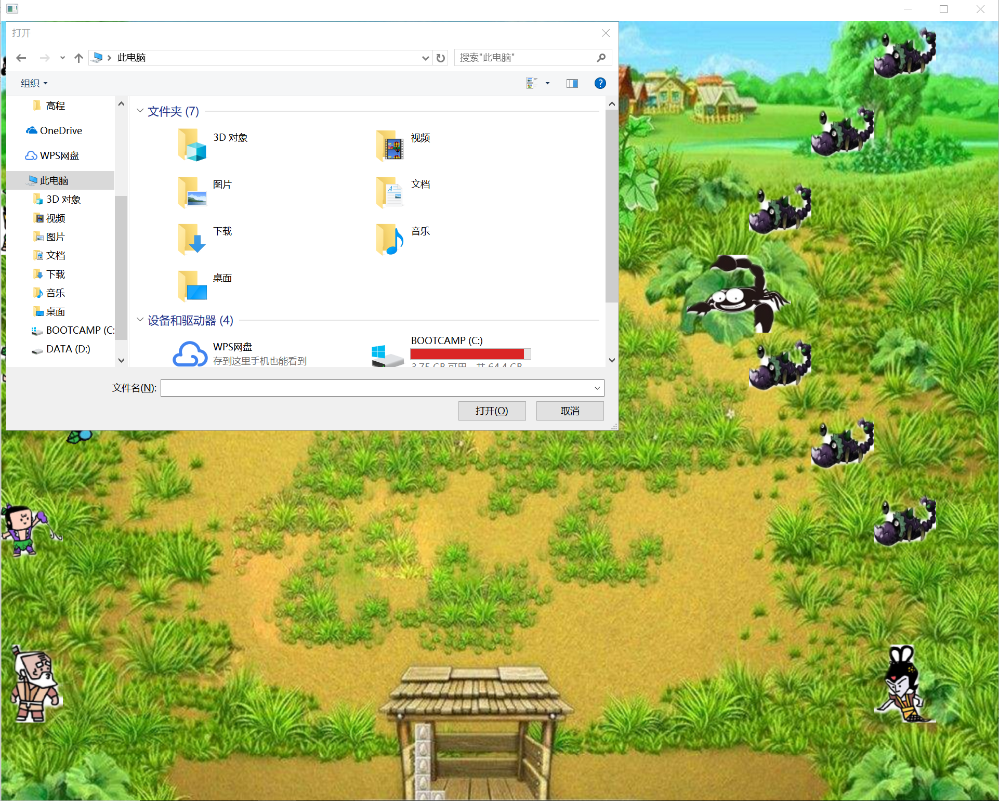
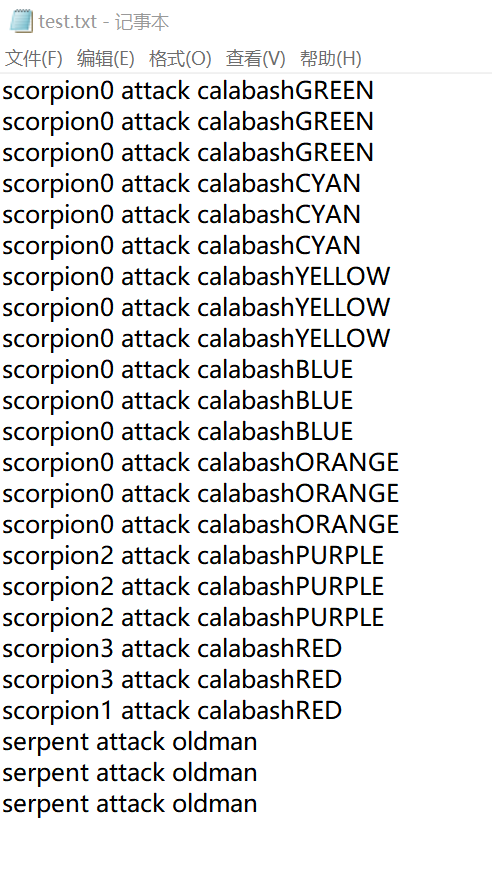

#实验报告
葫芦娃大战妖精

##主要的类
* class Main：Main类中的main函数是程序入口
* class Game：继承自javafx的Application，主要用于控制和管理游戏进行
* class Creature：抽象类，实现了一些生物的通用方法，如根据时间和速度更新位置，寻找下一个攻击目标...
* class CreatureThread：对于每一个程序中的实体生物，创造一个线程并运行。
* class Calabash, class Oldman, class Serpent, class Scorpion...: Creature的子类，对每个生物进行了一些特殊化处理。

##代码说明

* 程序入口main函数所在类为class Main，在该函数中创建一个Game，并通过startTheGame()运行该游戏

* Game自动调用start函数，并在其中调用了Game中的buildTheWorld()方法，该方法用于进行游戏界面和游戏人物的初始化。然后创建一个AnimationTimer,当检测到有空格键按下则游戏开始，启动各个生物线程；当检测到有键盘“L”键按下则跳出文件选择会话框，选择一个游戏记录进行回放。
* 生物线程启动后（即进入线程的run()方法），同样创建一个AnimationTimer,每次进入handle()函数时调用生物的updateLocation()和fight()来更新位置和战斗，并实时更新信息到InfoItem中。其中若fight()没有射程范围内的攻击对象，则会调用setDirection()方法根据地方生物体位置重新修改生物体在x和y轴方向的速度。
当有一方生物体全部死亡，则输出“game over”或“you win!”，同时将infoItem中的程序信息保存到文件中。
* 对于回放的游戏记录，将文件信息读取到infoItem中，并按照infoItem中的信息运行游戏。

## Java：面向对象

* 封装：每个生物体内部状态（如生命值、攻击力大小）对外不可见，通过互相传递消息来进行数据操作。
* 继承：Calabash，Oldman,Serpent，Scorpion都继承自抽象类Creature，所以能够使用Creature的方法。
* 集合类型：多处用到了ArrayList，并调用其操作
* 泛型： CreatureThread有类型参数< T extends Creature>,对传入参数有所限制。

##运行效果
* 按下空格键，游戏开始运行，并把记录输出到文件中：

* 按下“L”键，跳出文件会话框，选择一个战斗记录文件，运行回放记录：

